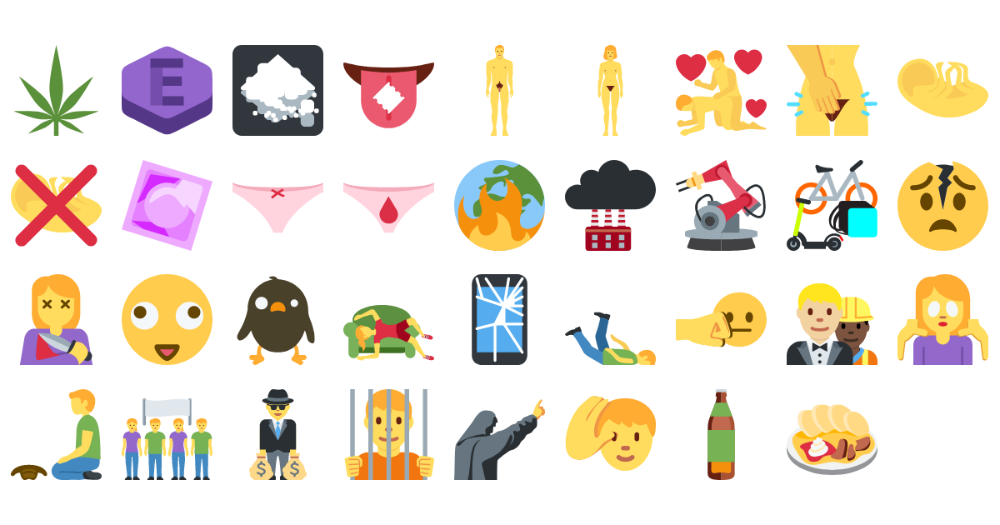

# Real Emoji

A proposal for 35 new emoji that go beyond the hugs and kisses of the standard
emoji set. See the [Real Emoji website](https://real-emoji.ooooo.page/) for more
information.



## Download and installation

Real Emoji are available as:

- Telegram stickers: [download](https://real-emoji.ooooo.page/stickers/)
- font file: [download and installation instructions](https://real-emoji.ooooo.page/font/)

## Development

### Building the font file

1. Install the following dependencies:

    - make
    - librsvg
    - nototools (available in [Arch Linux User
      Repository](https://aur.archlinux.org/packages/nototools-git/))
    - optipng
    - pngquant
    - svgo

2. Build the scfbuild Docker image:

    ```shell
    cd twemoji-color-font/scfbuild && make
    ```

3. Build the font file:

    ```shell
    make font
    ```

If everything succeeds, you will find the TTF file in the `static/fonts/`
directory.

### Building the website

1. Install the following dependencies:

    - zola
    - inkscape
    - optipng
    - webify (available in [Arch Linux User
      Repository](https://aur.archlinux.org/packages/webify/))
    - woff2

2. Build the static website and start a local web server:

    ```shell
    make serve
    ```

## Acknowledgements

The build system is based on [eosrei/twemoji-color-font: Twitter Unicode 12
emoji color SVGinOT font for
Linux/MacOS/Windows](https://github.com/eosrei/twemoji-color-font).

The standard emojis are copied from the [Twemoji
font](https://twitter.github.io/twemoji/) by Twitter licensed under
[CC-BY](http://creativecommons.org/licenses/by-sa/4.0/).

The design of Real Emoji is based on [Twitter Emoji
(Twemoji)](https://twitter.github.io/twemoji/). The design of the [fetus
emoji](./static/svg/fetus.svg) is based on a [photo by the National Museum of
Health and Medicine available at
Wikipedia](https://en.wikipedia.org/wiki/File:Fetus_3_months.jpg). The design of
the [moralizing emoji](./static/svg/moralizing.svg) is based on a [woodcut by
Julius Schnorr von Carolsfeld available at
Wikipedia](https://en.wikipedia.org/wiki/File:Schnorr_von_Carolsfeld_Bibel_in_Bildern_1860_102.png). The
design of the [Svíčková na smetaně emoji](./static/svg/svickova.svg) is based on
a [photo by Matyáš Havel available at
Wikipedia](https://en.wikipedia.org/wiki/Sv%C3%AD%C4%8Dkov%C3%A1#/media/File:Sv%C3%AD%C4%8Dkov%C3%A1_na_smetan%C4%9B.JPG). The
color of the [ugliness emoji](./static/svg/ugly.svg) is Pantone 448C, a color
[voted the ugliest colour in the
world](https://www.theguardian.com/fashion/2016/jun/08/stylewatch-pantone-448c-ugliest-colour-world-opaque-couche-australian-smokers-fashion).

## Contributing

__Feel free to remix this project.__

The code is licensed under the [Apache License, Version
2.0](http://www.apache.org/licenses/LICENSE-2.0).

The graphics (SVG images) are licensed under the [Creative Commons
Attribution-ShareAlike 4.0 International
License](http://creativecommons.org/licenses/by-sa/4.0/).
